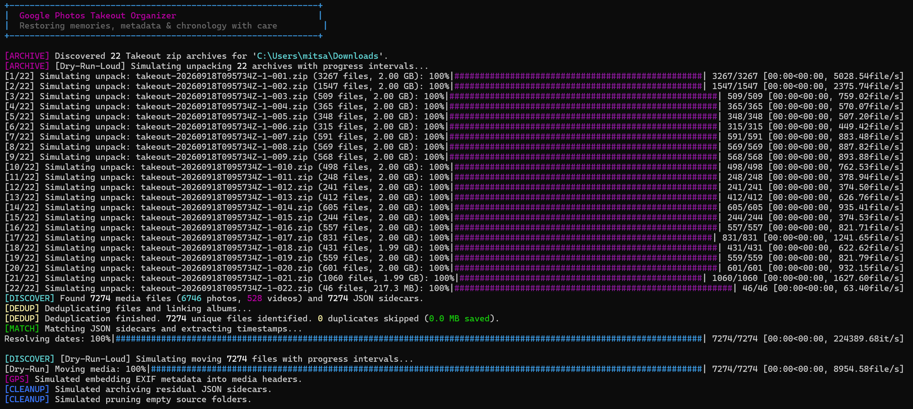
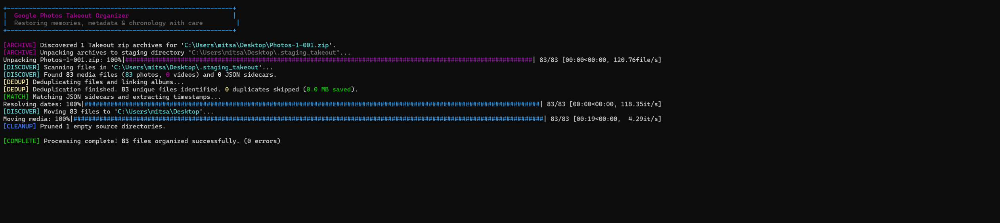
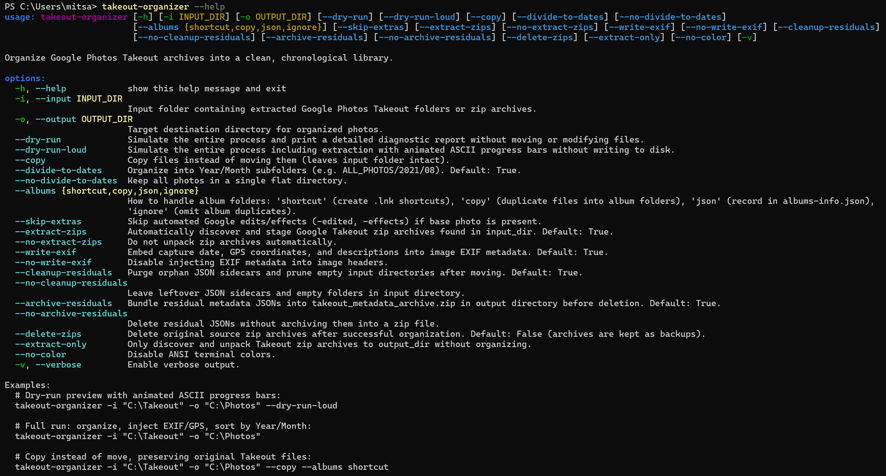

# Google Photos Takeout Organizer

[](https://www.python.org/downloads/)
[](LICENSE)
[]()
[]()

Organizes Google Photos Takeout archives into a chronological folder structure, matches Google JSON metadata sidecars, writes EXIF timestamps and GPS tags directly into media headers, and deduplicates album copies.



## Overview

Google Photos Takeout exports photos / videos across multiple split zip archives while storing timestamps, GPS coordinates, and descriptions in separate `.json` sidecars / metadata files; a mess in general.

This CLI tool handles the reorganization:
- Automatically discovers and extracts multi-part Takeout archives (`takeout-*-001.zip` to `takeout-*-NNN.zip`).
- Matches media files with their corresponding JSON sidecars, handling 51-character filename truncations, duplicate naming patterns (`photo(1).jpg`), and supplemental metadata formats.
- Injects original capture dates, GPS coordinates, and descriptions directly into image EXIF metadata (JPEG, WebP, TIFF).
- Sorts media chronologically into `YYYY/MM` directory structures.
- Identifies duplicate media across timelines and albums via SHA-256, generating native Windows `.lnk` shortcuts, copies, or metadata logs to eliminate redundant storage.
- Archives residual sidecars into a single `takeout_metadata_archive.zip` and prunes empty source folders.
- Provides a safe dry-run simulation mode (`--dry-run-loud` or `--dry-run`) with live progress bars without writing to disk.



## Installation

Install in editable mode using `pip` (poor man's Python package :/):

```bash
pip install -e .
```

This installs the package and registers the `takeout-organizer` CLI command.

## Usage

### Dry Run Preview (Simulate Without Writing to Disk)
```bash
takeout-organizer -i "C:\Takeout" -o "C:\Photos" --dry-run-loud
```

### Full Organization (Move, Match Metadata, Write EXIF, Sort by Date)
```bash
takeout-organizer -i "C:\Takeout" -o "C:\Photos"
```

### Copy Mode with Album Shortcuts
```bash
takeout-organizer -i "C:\Takeout" -o "C:\Photos" --copy --albums shortcut
```

### Pure Chronology (Ignore Albums)
```bash
takeout-organizer -i "C:\Takeout" -o "C:\Photos" --albums ignore
```

### Standalone Zip Extraction Only
```bash
takeout-organizer --extract-only -i "C:\Takeout" -o "C:\Extracted"
```

## CLI Reference

```
takeout-organizer [-h] [-i INPUT_DIR] [-o OUTPUT_DIR] [--dry-run] [--dry-run-loud]
                         [--copy] [--divide-to-dates] [--no-divide-to-dates]
                         [--albums {shortcut,copy,json,ignore}] [--skip-extras]
                         [--extract-zips] [--no-extract-zips] [--write-exif]
                         [--no-write-exif] [--cleanup-residuals]
                         [--no-cleanup-residuals] [--archive-residuals]
                         [--no-archive-residuals] [--delete-zips] [--extract-only]
                         [--no-color] [-v]
```



| Flag | Description | Default |
| :--- | :--- | :--- |
| `-i, --input` | Input directory containing Takeout zip archives or extracted folders | Required |
| `-o, --output` | Target destination directory for organized library | Required |
| `--dry-run` | Simulate process and output diagnostic summary without modifying files | `False` |
| `--dry-run-loud` | Simulate process with animated progress bars without writing to disk | `False` |
| `--copy` | Copy files instead of moving them (preserves input directory) | `False` |
| `--divide-to-dates` | Organize media into `YYYY/MM` subfolders | `True` |
| `--no-divide-to-dates` | Place all media into a single flat directory | `False` |
| `--albums` | Album handling strategy: `shortcut` (`.lnk`), `copy`, `json`, or `ignore` | `shortcut` |
| `--skip-extras` | Skip automated Google edits (`-edited`, `-effects`) when base photo exists | `False` |
| `--extract-zips` | Automatically discover and unpack Takeout zip archives in input directory | `True` |
| `--no-extract-zips` | Do not unpack zip archives automatically | `False` |
| `--write-exif` | Embed capture date, GPS coordinates, and descriptions into EXIF headers | `True` |
| `--no-write-exif` | Disable writing EXIF metadata to media files | `False` |
| `--cleanup-residuals` | Purge orphan JSON sidecars and prune empty input directories | `True` |
| `--no-cleanup-residuals` | Leave residual JSON sidecars and folders in input directory | `False` |
| `--archive-residuals` | Bundle residual JSON sidecars into `takeout_metadata_archive.zip` | `True` |
| `--no-archive-residuals` | Delete residual JSONs without archiving | `False` |
| `--delete-zips` | Delete original source zip archives after successful organization | `False` |
| `--extract-only` | Extract Takeout zip archives to output directory without organizing | `False` |
| `--no-color` | Disable ANSI terminal colors | `False` |
| `-v, --verbose` | Enable verbose debugging output | `False` |

## License

MIT License.
